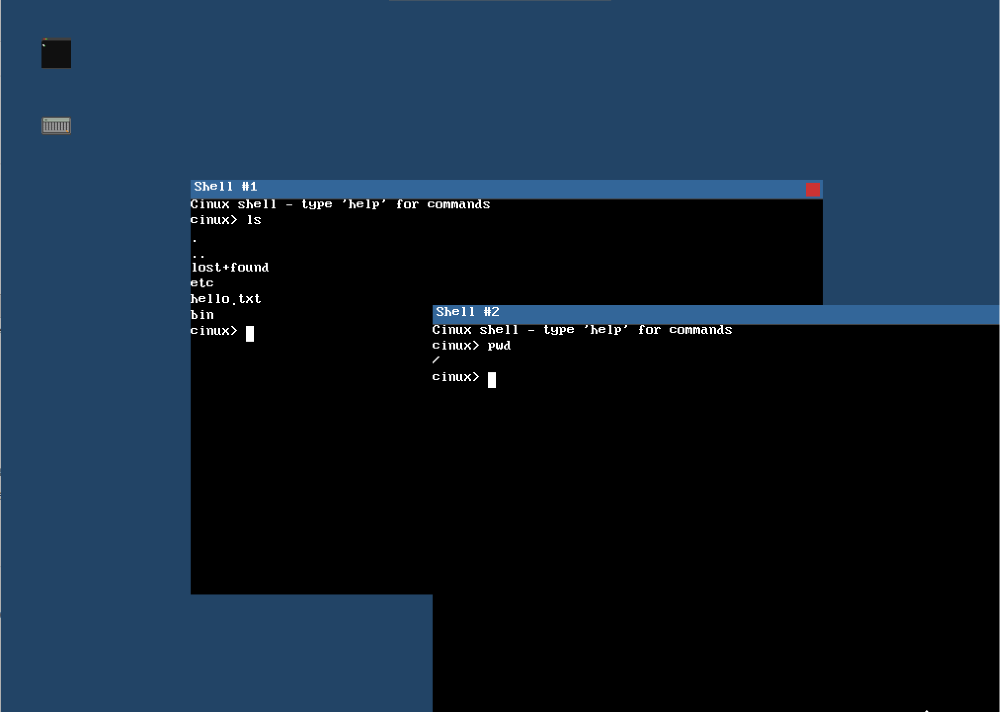
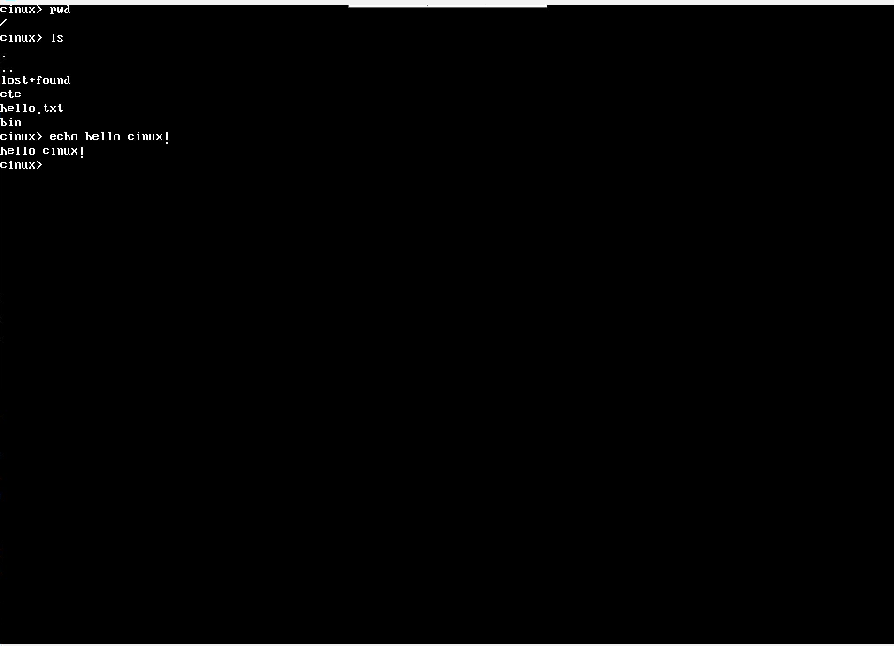
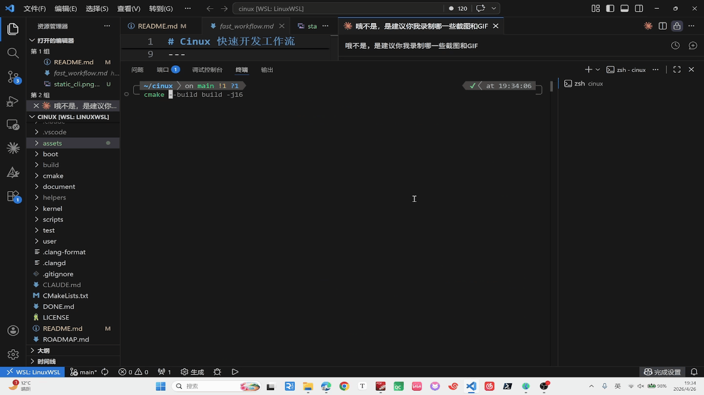
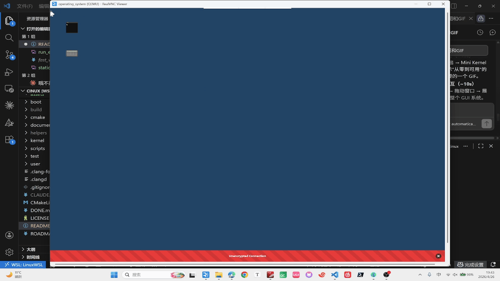
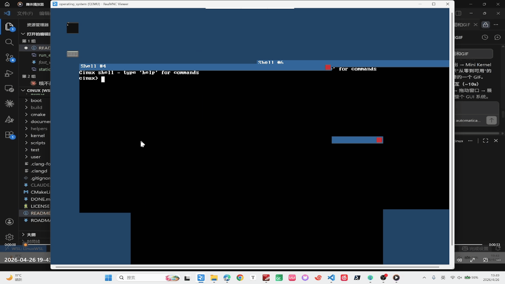
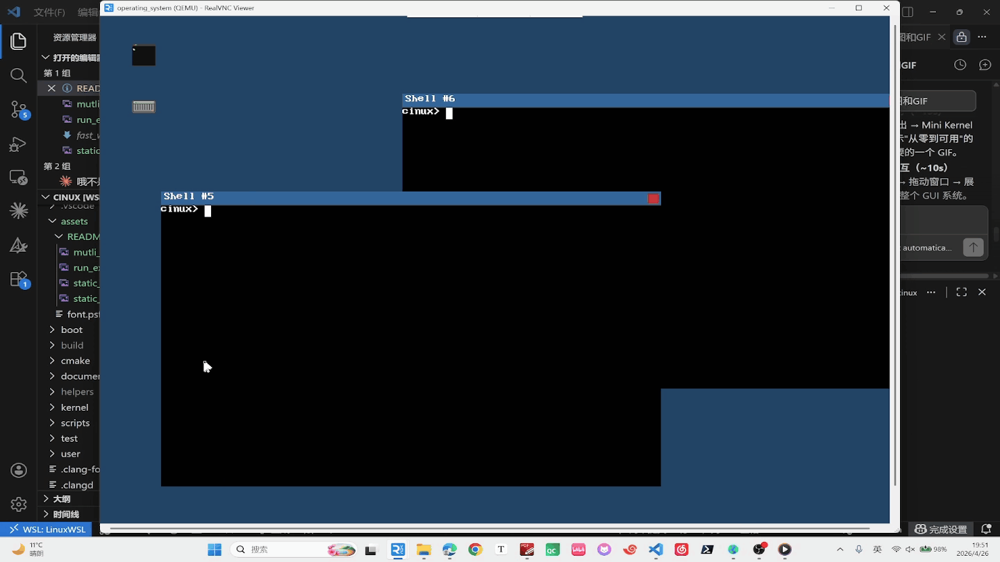

<div align="center">

# 🐧 Cinux

### x86_64 操作系统 · 现代 C++ 实现

[](LICENSE)
[]()
[]()
[]()

一个基于 x86_64 架构的操作系统——从 Bootloader 到 GUI 桌面，全链路实现。

> **Note:** 本项目迁移自教程操作系统 [Cinux](https://github.com/Charliechen114514/Cinux)

</div>

---

## ✨ 项目简介

**Cinux** 是一个基于 x86_64 架构的操作系统，采用现代 C++ 编写。

> 💡 **为什么叫 Cinux？**
> - C/C++'s Linux, 也就是尝试重新再写一个基于C/C++的Linux
> - CharlieChen's *nux（逃）

---

## 🖼️ Screenshots

<p align="center">
  
  
</p>
<p align="center">
  <em>GUI 桌面环境（左） · CLI 终端环境（右）</em>
</p>

<p align="center">
  
  
</p>
<p align="center">
  <em>从启动到 Shell（左） · 多终端窗口（右）</em>
</p>

<p align="center">
  
  
</p>
<p align="center">
  <em>多终端并发执行（左） · Ext2 文件操作（右）</em>
</p>

---

## 🌟 特性亮点

<table>
<tr>
<td width="50%">

🧠 **完整 x86_64 内核**
Bootloader → Mini Kernel → Big Kernel → User Space → GUI 桌面，全链路打通

</td>
<td width="50%">

📁 **Ext2 文件系统读写**
VFS 抽象层 + AHCI SATA 驱动，支持 touch/mkdir/rm/cat/ls/cd/stat

</td>
</tr>
<tr>
<td>

🖥️ **GUI 桌面环境**
Canvas 双缓冲 + 窗口管理器 + PS/2 鼠标驱动，支持拖动 / Z-order / 桌面图标

</td>
<td>

⚡ **多进程 & 多终端**
fork/execve/CoW 页表复制 + Pipe IPC，每个终端绑定独立 shell 进程

</td>
</tr>
<tr>
<td>

👨‍💻 **Ring 3 用户态 Shell**
22 个系统调用，内置 echo / help / clear / ls / cat / cd / pwd / stat / mkdir / rm / touch

</td>
<td>

🧪 **测试驱动开发**
自研轻量测试框架，Host 端 mock 测试 + QEMU 集成内核测试双轨并行

</td>
</tr>
<tr>
<td>

🔧 **现代 C++23 实现**
`constexpr` 编译期生成 GDT/IDT / `concepts` 类型约束 / RAII 锁管理 / `enum class` 驱动接口 / 支持用户态内核态 SSE （故支持-O2 Release构建）

</td>
</tr>
</table>

---

## 🚀 快速开始

### 前置要求

本项目支持最新的 g++ 15.2编译，使用CMake构建项目，您需要安装的是

```bash
# Ubuntu/Debian
sudo apt install -y gcc g++ binutils qemu-system-x86_64 cmake
```

### 构建 & 运行

🚀🚀🚀 在WSL 或者任何您喜欢的发行版中跑起来它们！🚀🚀🚀

> Feature Help: 不知道有没有好心人愿意移植到Windows上可编译，如果有所变动欢迎提交您的PR！

#### Step 1️⃣: 配置

```bash
#  配置为GUI（默认）（Release 模式），也是最推介的！🚀
cmake -B build -DCMAKE_BUILD_TYPE=Release -S .

# 或者，默认（速度稍慢）
cmake -B build  -S .

# 或者你fork改炸了准备使用VSCode调试
cmake -B build -DCMAKE_BUILD_TYPE=Debug -S .

# 带测试的配置
cmake -B build -DCINUX_BUILD_TESTS=ON -S .

# CLI运行环境
cmake -B build -DCINUX_GUI=OFF -S .   
```

#### Step 2️⃣: 构建
```bash
cmake --build build -j$(nproc)
```

#### Step 3️⃣: Cinux，启动!

```bash
cmake --build build --target run # 跑内核本体, 默认Launch的是VNC显示，您需要VNC！
cmake --build build --target test_host           # Host 端单元测试（CTest）
cmake --build build --target run-kernel-test     # QEMU 内核测试（自动退出）
```

### 调试模式 1：GDB大牛请走这里

```bash
# 终端 1：启动 QEMU + GDB server
make run-debug

# 终端 2：连接 GDB
gdb build/kernel.elf
(gdb) target remote :1234
(gdb) break kernel_main
(gdb) continue
```

### 调试模式 2：VSCode大牛请走这里（是的别坐牢，如果不喜欢GDB!）

**Step 1：** 一键脚本构建并启动 QEMU 调试模式（Debug 构建 + GDB stub 监听 `:1234`）：

```bash
bash scripts/launch_qemu_debug.sh
```

**Step 2：** 确认 `.vscode/launch.json` 中已有如下配置：

> PS：大内核需要改一下ELF，这个麻烦自己手调。
```json
{
    "name": "QEMU 调试 (mini kernel)",
    "type": "cppdbg",
    "request": "launch",
    "program": "${workspaceFolder}/build/kernel/mini/mini_kernel",
    "MIMode": "gdb",
    "miDebuggerServerAddress": "localhost:1234",
    ...
}
```

**Step 3：** 在 VSCode 中按 **F5**，选择对应的调试配置即可开始图形化断点调试。

---

## 🛠️ 技术栈亮点

<details>
<summary><b>🔍 现代 C++ 内核开发</b></summary>

- ✅ **C++23 特性**：`constexpr` / `concepts` / `requires`
- ✅ **编译期魔法**：GDT/IDT 描述符 `constexpr` 生成，桌面图标 `constexpr` 像素数据
- ✅ **类型安全**：`enum class` 作为 API 一等公民，`concepts` 约束驱动接口
- ✅ **RAII 资源管理**：Spinlock::guard、InterruptGuard、锁自动释放
- ✅ **零标准库依赖**： freestanding，自实现 memset/memcpy/string

</details>

<details>
<summary><b>🧪 自研测试框架</b></summary>

```cpp
// 极简 API
TEST("测试名称") {
    ASSERT_EQ(actual, expected);
    ASSERT_TRUE(condition);
}

// 双轨测试策略
// Host 端：mock 硬件，验证逻辑正确性（快速迭代）
// Kernel 端：QEMU 运行，验证真实硬件行为（端到端）
```

</details>

---

## 🤝 参与贡献

欢迎贡献！你可以：

- 🐛 修复 Bug
- ✍️ 完善文档
- 💡 提出改进建议
- 📢 分享你的学习经验

---

## 📄 许可证

本项目采用 [MIT License](LICENSE) 开源协议。

---

## 🙏 致谢

- [Cinux 教程项目](https://github.com/Charliechen114514/Cinux) - 这是本项目的起源！
- [OSDev Wiki](https://wiki.osdev.org/) - 宝贵的 OS 开发知识库
- [Writing an OS in Rust](https://os.phil-opp.com/) - 优秀的 OS 开发参考
- 所有为开源社区贡献的开发者

---

<div align="center">

**⭐ 如果这个项目对你有帮助，请给一个 Star！**

Made with ❤️ by [CharlieChen114514](https://github.com/Charliechen114514)

</div>
